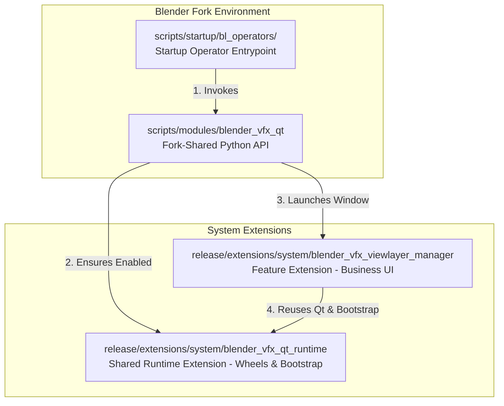

# bQt Integration & Usage Guide

Industrial CG Platform bundles a complete, production-grade PyQt/PySide6 runtime environment (**bQt**) directly as a system extension. This enables developers to author rich, high-performance Qt-based UI tools inside Blender without forcing artists to install python packages manually.

This guide details the integration architecture, packaging layout rules, standalone safety environment configurations, and advanced software engineering patterns implemented in the built-in **ViewLayer Manager** addon.

---

## 1. The Three-Layer Integration Architecture

To keep the codebase maintainable, reusable, and secure, BQt integrations on this Blender fork are decoupled into three distinct layers:



### Layer 1: The Shared Runtime Extension (`blender_vfx_qt_runtime`)
* **Location:** `release/extensions/system/blender_vfx_qt_runtime`
* **Responsibility:** Carries the heavy pre-compiled wheels (PySide6, dependencies) and contains the low-level bootstrap code. It exposes a minimal runtime initialization hook and does **no** business or UI logic.

### Layer 2: The Fork-Shared Python Wrapper (`blender_vfx_qt`)
* **Location:** `scripts/modules/blender_vfx_qt`
* **Responsibility:** A permanent, fork-wide utility module. It resolves the runtime extension, guarantees Qt event-loop integration, and exposes stable window management APIs:
  - `ensure_runtime()`: Initialises Qt and binds it to Blender.
  - `show_unique_window(cache, factory)`: Manages window singletons.

### Layer 3: The Feature Extension (e.g., `blender_vfx_viewlayer_manager`)
* **Location:** `release/extensions/system/blender_vfx_viewlayer_manager`
* **Responsibility:** Focuses strictly on business logic (UI frames, RNA property sync, presets, and translations). It carries no wheels and dynamically calls Layer 2 to spin up its UI.

---

## 2. Session-Based Enablement & Entrypoints

To avoid slowing down Blender's startup time or cluttering the user's permanent preferences, BQt utilizes a **Session-Based Enablement** pattern:

1. The runtime is **not** permanently enabled in the user's preferences.
2. A lightweight Blender Operator (bridge operator) is registered in the startup scripts: `scripts/startup/bl_operators/blender_vfx_viewlayer_manager.py`.
3. When the artist clicks the operator's entrypoint (e.g., a menu button or spacebar search), the operator dynamically calls `blender_vfx_qt.ensure_runtime()`, enabling the system extensions and showing the window *only for the active Blender session*.

### Bridge Operator Blueprint:
```python
import bpy

class VFX_OT_show_viewlayer_manager(bpy.types.Operator):
    """Launch the standalone Qt ViewLayer Manager"""
    bl_idname = "wm.blender_vfx_viewlayer_manager_show"
    bl_label = "ViewLayer Manager"
    
    def execute(self, context):
        # 1. Resolve the shared module
        from blender_vfx_qt import ensure_runtime
        try:
            # 2. Dynamically enable runtime extensions & get bQt hook
            bqt = ensure_runtime()
            
            # 3. Call the feature extension manager to present UI
            from bl_ext.system.blender_vfx_viewlayer_manager.manager import show_manager
            show_manager()
            return {'FINISHED'}
        except Exception as e:
            self.report({'ERROR'}, f"Failed to launch ViewLayer Manager: {str(e)}")
            return {'CANCELLED'}
```

---

## 3. Creating a Managed Window (Singleton Pattern)

To prevent multiple instances of the same tool window (which easily leads to scene data conflicts and memory leaks), tools must assign a unique `objectName` and register with `bqt.add(..., unique=True)`.

### Singleton Launch Pattern:
```python
# release/extensions/system/blender_vfx_viewlayer_manager/manager.py
from blender_vfx_qt import ensure_runtime, qt_window_is_alive, show_unique_window

# Dictionary cache to store the active window reference
_window_cache = {"value": None}

def show_manager():
    bqt = ensure_runtime()
    
    # If the window is already active, refresh its data and bring it to foreground
    cached_window = _window_cache.get("value")
    if qt_window_is_alive(cached_window):
        cached_window.refresh_from_blender()

    from .window import ViewLayerManagerWindow

    def factory():
        window = ViewLayerManagerWindow()
        # Register with unique=True to activate singleton safety checks
        bqt.add(window, unique=True)
        return window

    return show_unique_window(_window_cache, factory)
```

---

## 4. Standalone Safety Mode

By default, the platform runs in **Standalone Safety Mode** on this fork. This mode offers maximum UI stability, keyboard focus integrity, and prevents common crash vectors associated with embedding raw Win32 viewports inside Qt widgets.

### Environment Variable Defaults
Before launching the runtime, the `blender_vfx_qt` module enforces the following environment configurations:

* **`BQT_DISABLE_WRAP="1"`**: Disables embedding Blender's viewport inside a Qt layout container. The Qt window runs as a separate, native standalone window.
* **`BQT_AUTO_ADD="0"`**: Prevents BQt from automatically parenting orphan top-level Qt dialogs, ensuring strict developer-defined parenting.
* **`BQT_DOCKABLE_WRAP="0"`**: Disables automatic nesting of registered widgets inside `QDockWidget` panels.
* **`BQT_MANAGE_FOREGROUND="1"`**: Monitors active OS window handles. When switching away from Blender, it automatically hides all registered Qt windows; when focusing back to Blender, it instantly restores their visibility.

> [!NOTE]
> Under Standalone Safety Mode, the console will output a warning: `failed to get blender hwnd, creating new window`. **This is expected and harmless.** It indicates the standalone routing succeeded and should not be misidentified as a crash root-cause.

---

## 5. Environment Configurations Reference

| Environment Variable | Default Value | Allowed Values | Description |
| :--- | :--- | :--- | :--- |
| **`BQT_DISABLE_WRAP`** | `0` (Unset) | `1`, `0` | Set to `1` to enable Standalone Safety Mode, bypassing viewport container wrapping. |
| **`BQT_AUTO_ADD`** | `1` (Unset) | `1`, `0` | Set to `0` in the shared wrapper to prevent accidental auto-parenting of native floaters. |
| **`BQT_DOCKABLE_WRAP`** | `1` (Unset) | `1`, `0` | Set to `0` to keep widgets clean and floating, instead of dockable side-panels. |
| **`BQT_MANAGE_FOREGROUND`** | `1` | `1`, `0` | Active when `BQT_DISABLE_WRAP="1"`. Toggles automatic hide/restore visibility sync. |
| **`BQT_NO_STYLESHEET`** | `0` (Unset) | `1`, `0` | Set to `1` to bypass the custom dark Blender stylesheet. |
| **`BQT_DISABLE_CLOSE_DIALOGUE`**| `0` (Unset) | `1`, `0` | Set to `1` to bypass custom close save prompts, delegating to Blender's quit handler. |
| **`BQT_LOG_LEVEL`** | `"WARNING"` | `"DEBUG"`, `"INFO"`, `"WARNING"`, `"ERROR"` | Configures logging verbosity. |

---

## 6. System Extension Packaging & Layout Rules

> [!CAUTION]
> **CRITICAL PACKAGING RULE:** Do not wrap your system extension inside a duplicate `system` subdirectory. Doing so breaks package scanning and triggers `bl_ext.system.*` import errors.

### Correct Directory Layout
```
📂 release/extensions/system/
    ├── 📂 blender_vfx_qt_runtime/         # Correctly placed under system/
    │     ├── 📄 blender_manifest.toml
    │     └── 📄 __init__.py
    └── 📂 blender_vfx_viewlayer_manager/  # Correctly placed under system/
          ├── 📄 blender_manifest.toml
          └── 📄 __init__.py
```

### Incorrect Nested Layout (DO NOT USE)
```
📂 release/extensions/system/
    └── 📂 system/                          # INCORRECT NESTING LAYER
          └── 📂 blender_vfx_viewlayer_manager/
```

* **The Cause:** Blender's native extension manager automatically prepends the `system` namespace directory when registering system repositories. If you manually create a duplicate `system/system/` folder structure on disk, the repository registers but scans as empty, causing `bl_ext.system.blender_vfx_viewlayer_manager` imports to fail.

---

## 7. Advanced ViewLayer Manager Design Patterns

The **ViewLayer Manager** implements five advanced patterns for production-grade Qt integration inside Blender:

### Pattern 1: Context Window Preservation (`@context_window`)
When a Qt signal (like clicking a button) executes a slot, the function runs inside Qt's event loop. If it tries to modify Blender's RNA data or call operators (e.g., `bpy.ops.ed.undo_push`), Blender will crash or fail due to incorrect context. 

To solve this, decorate all state-altering Qt methods with the `@context_window` decorator imported from `bqt.utils`:

```python
from bqt.utils import context_window
import bpy

class ViewLayerManagerWindow(QtWidgets.QDialog):
    
    @context_window
    def _set_view_layer_use_in_blender(self, view_layer_name: str, value: bool) -> bool:
        # Runs under a safe, active Blender context window parameters
        view_layer = self._find_view_layer(view_layer_name)
        if view_layer is None:
            return False
        
        if view_layer.use != value:
            view_layer.use = value
            # Safe to push undo state
            bpy.ops.ed.undo_push(message="ViewLayer Manager: Update Use")
            return True
        return False
```

### Pattern 2: Dual-Path Bidirectional Synchronization
Artists can still manipulate viewlayers or passes inside native Blender panels while the Qt window is open. To maintain perfect synchronization without thread conflicts, use a dual sync approach:

#### A. QTimer Polling for Active Context Selection
A low-frequency `QTimer` polls Blender's active selection state:
```python
self._active_state_timer = QtCore.QTimer(self)
self._active_state_timer.setInterval(150) # 150ms interval
self._active_state_timer.timeout.connect(self._poll_active_view_layer_state)
self._active_state_timer.start()

def _poll_active_view_layer_state(self) -> None:
    active_name = bpy.context.view_layer.name
    if active_name != self._last_active_view_layer_name:
        self._sync_active_view_layer_from_context()
```

#### B. Blender MsgBus with Thread-Safe Scheduling
For immediate synchronization without heavy polling, subscribe to Blender's MsgBus. To prevent executing UI repaints directly inside the MsgBus execution thread, schedule the update on Qt's event loop using `QTimer.singleShot(0, ...)`:

```python
def _register_message_bus(self) -> None:
    # Subscribe to active view_layer changes
    bpy.msgbus.subscribe_rna(
        key=(bpy.types.Window, "view_layer"),
        owner=self._msgbus_owner,
        args=(self,),
        notify=self._notify_active_view_layer_changed,
    )

def _notify_active_view_layer_changed(window: "ViewLayerManagerWindow") -> None:
    # Thread-safe dispatch back to Qt's event loop
    QtCore.QTimer.singleShot(0, window._sync_active_view_layer_from_context)
```

### Pattern 3: Custom Drag-and-Sweep Checkboxes ("Brush Selection")
When handling massive tables of passes, clicking boxes individually is tedious. The ViewLayer Manager implements a "brush" selection: clicking a checkbox and dragging across others toggles them all in a single sweep.

This is implemented using a custom subclass and a global application event filter:

```python
class BrushCheckBox(QtWidgets.QCheckBox):
    def mousePressEvent(self, event) -> None:
        if event.button() == QtCore.Qt.MouseButton.LeftButton and self.isEnabled():
            # Delegate to window to begin sweep brush state
            if self._manager._begin_checkbox_brush(self):
                event.accept()
                return
        super().mousePressEvent(event)
```

In the main window, install the event filter during the sweep:
```python
def eventFilter(self, watched, event) -> bool:
    if self._checkbox_brush_active:
        if event.type() == QtCore.QEvent.Type.MouseMove:
            # Detect left-click drag state
            buttons = event.buttons()
            if not (buttons & QtCore.Qt.MouseButton.LeftButton):
                self._end_checkbox_brush()
                return True
            
            # Find widget under mouse and apply brush toggle
            global_pos = QtGui.QCursor.pos()
            checkbox = self._find_brush_checkbox(QtWidgets.QApplication.widgetAt(global_pos))
            if checkbox:
                self._apply_checkbox_brush_to(checkbox)
            return True
            
        elif event.type() == QtCore.QEvent.Type.MouseButtonRelease:
            self._end_checkbox_brush()
            return True
            
    return super().eventFilter(watched, event)
```

### Pattern 4: Multi-Selection & Modifiers in Custom List Widgets
When putting custom frame widgets inside a `QListWidget` (via `setItemWidget`), the custom widgets intercept mouse clicks. This breaks standard `QListWidget` multi-selection (Shift/Ctrl clicks).

The ViewLayer Manager overrides `mousePressEvent` in the custom item frame to intercept active modifier states and manually trigger standard selection rules on the list widget:

```python
class ViewLayerListRowWidget(QtWidgets.QFrame):
    clicked = QtCore.Signal(str, int) # Passes layer name and active modifiers int value

    def mousePressEvent(self, event) -> None:
        if event.button() == QtCore.Qt.MouseButton.LeftButton:
            modifiers = event.modifiers()
            modifier_value = getattr(modifiers, "value", modifiers)
            self.clicked.emit(self._view_layer_name, int(modifier_value))
            event.accept()
            return
        super().mousePressEvent(event)
```

Inside the window class, listen to the custom signal and implement multi-select logic:
```python
def _on_classic_row_clicked(self, view_layer_name: str, modifiers: int) -> None:
    ctrl_pressed = bool(modifiers & QtCore.Qt.KeyboardModifier.ControlModifier.value)
    shift_pressed = bool(modifiers & QtCore.Qt.KeyboardModifier.ShiftModifier.value)
    
    self.view_layer_list.blockSignals(True)
    if shift_pressed and self._selection_anchor:
        # Select everything between anchor and target row
        self._select_range(self._selection_anchor, view_layer_name)
    elif ctrl_pressed:
        # Toggle clicked item selection state
        self._toggle_selection(view_layer_name)
    else:
        # Normal single click selection
        self._select_single(view_layer_name)
        self._selection_anchor = view_layer_name
    self.view_layer_list.blockSignals(False)
    
    self.refresh_from_blender()
```

### Pattern 5: Smooth Pixel-Based List Scroll
For list views containing numerous elements, line-by-line item scrolling feels stuttery. Force pixel-based scroll increments:

```python
def _configure_smooth_scroll(view: QtWidgets.QAbstractScrollArea) -> None:
    view.setVerticalScrollMode(QtWidgets.QAbstractItemView.ScrollMode.ScrollPerPixel)
    
    vertical_scrollbar = view.verticalScrollBar()
    vertical_scrollbar.setSingleStep(18)  # Smooth step size in pixels
    vertical_scrollbar.setPageStep(72)    # Page step size in pixels
```

---

## 8. Workflow for Integrating a New Qt Tool

If you need to add a new Qt-based UI tool to this Blender fork, follow this structured, safe procedure:

### Step 1: Establish the Entrypoint Bridge
Create a lightweight, searchable bridge operator under `scripts/startup/bl_operators/` (e.g., `blender_vfx_my_new_tool.py`). Hook it into a menu button to confirm launching works before adding any UI logic.

### Step 2: Set Up the Feature Extension
Create a new system extension under `release/extensions/system/my_new_tool_extension/`. Build a basic `blender_manifest.toml` and reference it. Do **not** package wheels inside this folder.

### Step 3: Implement UI and Data Synchronization
Expose a thin launch script `manager.py` in your extension that calls `blender_vfx_qt.ensure_runtime()` and instantiates your standalone tool window class using the singleton pattern. Apply `@context_window` decorators to write-back functions.

---

## 9. Verification & Testing Pipeline

All BQt tools must undergo a multi-tiered verification pipeline before merging to main:

```
[Level 1: Compile Checks] ➔ [Level 2: Layout Checks] ➔ [Level 3: Background Smoke Tests] ➔ [Level 4: GUI Smoke Tests]
```

1. **Level 1: Compile Checks:** Verify syntactical correctness via `python -m compileall`.
2. **Level 2: Layout Checks:** Run layout checks to ensure extensions are not wrapped inside a nested `system/system/` layer. Verify layout via:
   ```bash
   ctest -R blender_vfx_system_extensions_layout_test
   ```
3. **Level 3: Background Smoke Tests:** Run headless tests in Blender background mode to confirm that ensuring BQt runtime doesn't throw exceptions.
4. **Level 4: GUI Smoke Tests:** Launch the built Blender environment and execute the operator to verify window rendering, smooth scrolling, and boundary sync.
