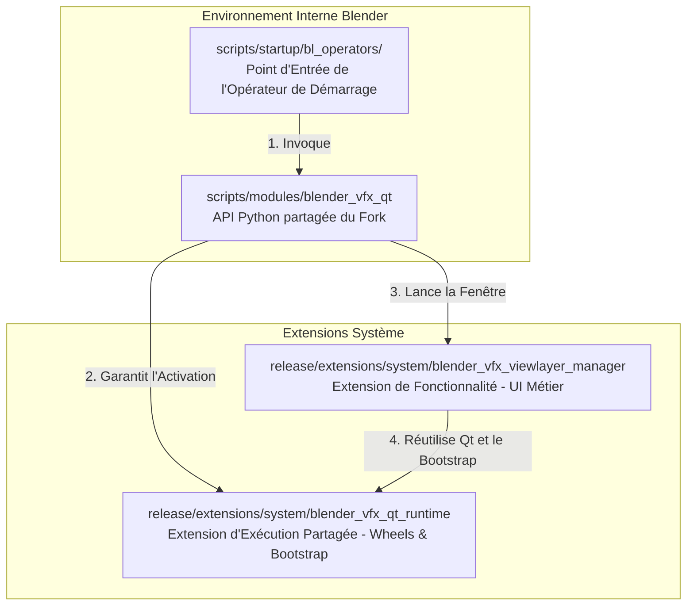

# Guide d'Intégration & d'Utilisation de bQt

Industrial CG Platform intègre un environnement d'exécution complet PyQt/PySide6 de qualité production (**bQt**) directement en tant qu'extension système. Cela permet aux développeurs de créer des outils d'interface utilisateur riches basés sur Qt au sein de Blender, sans obliger les artistes à installer manuellement des packages Python.

Ce guide détaille l'architecture d'intégration, les règles de disposition des packages (layout), les configurations d'environnement de sécurité autonome et les modèles avancés d'ingénierie logicielle implémentés dans l'extension intégrée **ViewLayer Manager**.

---

## 1. L'Architecture d'Intégration en Trois Couches

Pour garantir la maintenabilité, la réutilisabilité et la sécurité du code, les intégrations BQt sur ce fork de Blender sont découplées en trois couches distinctes :



### Couche 1 : L'Extension d'Exécution Partagée (`blender_vfx_qt_runtime`)
* **Emplacement :** `release/extensions/system/blender_vfx_qt_runtime`
* **Responsabilité :** Transporte les lourds packages précompilés (wheels de PySide6 et dépendances) et contient le code de bas niveau pour l'initialisation (Bootstrap). Elle expose un point d'entrée minimal et ne contient **aucune** logique métier ou d'interface utilisateur.

### Couche 2 : L'Enveloppe Python Partagée du Fork (`blender_vfx_qt`)
* **Emplacement :** `scripts/modules/blender_vfx_qt`
* **Responsabilité :** Un module utilitaire permanent à l'échelle du fork. Il résout l'extension d'exécution, garantit l'intégration de la boucle d'événements Qt avec celle de Blender, et expose des API de gestion de fenêtres stables :
  - `ensure_runtime()` : Initialise Qt et le lie à la fenêtre Blender.
  - `show_unique_window(cache, factory)` : Gère le cycle de vie des fenêtres de type Singleton.

### Couche 3 : L'Extension de Fonctionnalité (ex. `blender_vfx_viewlayer_manager`)
* **Emplacement :** `release/extensions/system/blender_vfx_viewlayer_manager`
* **Responsabilité :** Se concentre strictement sur la logique métier (création des cadres d'interface utilisateur, synchronisation des propriétés RNA, gestion des préréglages et traductions). Elle ne contient aucun fichier wheel précompilé et appelle dynamiquement la Couche 2 pour afficher son interface.

---

## 2. Activation Basée sur la Session (Session-Based Enablement)

Afin d'éviter de ralentir le démarrage de Blender ou d'encombrer les préférences de l'utilisateur, BQt utilise un modèle d'**Activation Basée sur la Session** :

1. L'extension d'exécution n'est **pas** activée en permanence dans les préférences de l'utilisateur.
2. Un opérateur Blender léger (opérateur de pont) est enregistré dans les scripts de démarrage : `scripts/startup/bl_operators/blender_vfx_viewlayer_manager.py`.
3. Lorsque l'artiste clique sur le point d'entrée (par exemple, un bouton de menu ou via la recherche), l'opérateur appelle dynamiquement `blender_vfx_qt.ensure_runtime()`, activant les extensions système et affichant la fenêtre *uniquement pour la session Blender en cours*.

### Plan de l'Opérateur de Pont :
```python
import bpy

class VFX_OT_show_viewlayer_manager(bpy.types.Operator):
    """Lance le gestionnaire ViewLayer autonome basé sur Qt"""
    bl_idname = "wm.blender_vfx_viewlayer_manager_show"
    bl_label = "ViewLayer Manager"
    
    def execute(self, context):
        # 1. Résoudre le module partagé
        from blender_vfx_qt import ensure_runtime
        try:
            # 2. Activer dynamiquement les extensions d'exécution et obtenir le point d'entrée bQt
            bqt = ensure_runtime()
            
            # 3. Appeler le gestionnaire de l'extension de fonctionnalité pour afficher l'interface utilisateur
            from bl_ext.system.blender_vfx_viewlayer_manager.manager import show_manager
            show_manager()
            return {'FINISHED'}
        except Exception as e:
            self.report({'ERROR'}, f"Échec du lancement du gestionnaire ViewLayer : {str(e)}")
            return {'CANCELLED'}
```

---

## 3. Création d'une Fenêtre Gérée (Modèle Singleton)

Pour éviter la duplication des fenêtres d'outils (qui entraîne des conflits d'écriture de données de scène et des fuites de mémoire), chaque fenêtre doit se voir attribuer un `objectName` unique et s'enregistrer avec `bqt.add(..., unique=True)`.

### Modèle de Lancement Singleton :
```python
# release/extensions/system/blender_vfx_viewlayer_manager/manager.py
from blender_vfx_qt import ensure_runtime, qt_window_is_alive, show_unique_window

# Dictionnaire de cache pour stocker la référence de la fenêtre active
_window_cache = {"value": None}

def show_manager():
    bqt = ensure_runtime()
    
    # Si la fenêtre est déjà active, rafraîchir ses données et la ramener au premier plan
    cached_window = _window_cache.get("value")
    if qt_window_is_alive(cached_window):
        cached_window.refresh_from_blender()

    from .window import ViewLayerManagerWindow

    def factory():
        window = ViewLayerManagerWindow()
        # S'enregistrer avec unique=True pour activer la vérification de sécurité Singleton
        bqt.add(window, unique=True)
        return window

    return show_unique_window(_window_cache, factory)
```

---

## 4. Mode de Sécurité Autonome (Standalone Safety Mode)

Par défaut, la plateforme s'exécute en **Mode de Sécurité Autonome** sur ce fork. Ce mode offre une stabilité maximale, assure l'intégrité de la focalisation (focus) du clavier et prévient les plantages aléatoires associés à l'intégration de fenêtres Win32 brutes dans des conteneurs de widgets Qt.

### Variables d'Environnement par Défaut
Avant de lancer l'environnement d'exécution, le wrapper `blender_vfx_qt` configure les variables d'environnement suivantes :

* **`BQT_DISABLE_WRAP="1"`** : Désactive l'intégration de la vue Blender dans un conteneur Qt. La fenêtre Qt s'exécute comme une fenêtre autonome native du système d'exploitation.
* **`BQT_AUTO_ADD="0"`** : Empêche bQt de capturer et de gérer automatiquement les boîtes de dialogue Qt orphelines de premier niveau, garantissant que la filiation est définie explicitement par le développeur.
* **`BQT_DOCKABLE_WRAP="0"`** : Désactive l'ancrage automatique des widgets enregistrés à l'intérieur de panneaux `QDockWidget`.
* **`BQT_MANAGE_FOREGROUND="1"`** : Surveille les handles de fenêtres actives du système d'exploitation. Si vous quittez Blender, toutes les fenêtres Qt enregistrées sont automatiquement masquées ; si vous revenez sur Blender, leur visibilité est restaurée.

> [!NOTE]
> En Mode de Sécurité Autonome, la console affiche l'avertissement suivant : `failed to get blender hwnd, creating new window`. **Cet avertissement est attendu et tout à fait inoffensif.** Il indique simplement que le routage autonome a réussi et ne doit pas être interprété comme la cause d'un crash.

---

## 5. Configurations d'Environnement de Référence

| Variable d'Environnement | Valeur par Défaut | Valeurs Autorisées | Description |
| :--- | :--- | :--- | :--- |
| **`BQT_DISABLE_WRAP`** | `0` (Non définie) | `1`, `0` | Définir sur `1` pour activer le Mode de Sécurité Autonome, contournant l'intégration du viewport. |
| **`BQT_AUTO_ADD`** | `1` (Non définie) | `1`, `0` | Forcée à `0` par le wrapper partagé pour éviter d'accaparer d'autres fenêtres flottantes natives. |
| **`BQT_DOCKABLE_WRAP`** | `1` (Non définie) | `1`, `0` | Définir sur `0` pour conserver les widgets sous forme de fenêtres flottantes simples. |
| **`BQT_MANAGE_FOREGROUND`** | `1` | `1`, `0` | Active lorsque `BQT_DISABLE_WRAP="1"`. Alerte Qt pour masquer/restaurer les fenêtres selon le focus. |
| **`BQT_NO_STYLESHEET`** | `0` (Non définie) | `1`, `0` | Définir sur `1` pour contourner la feuille de style sombre personnalisée de Blender. |
| **`BQT_DISABLE_CLOSE_DIALOGUE`**| `0` (Non définie) | `1`, `0` | Définir sur `1` pour désactiver la confirmation de fermeture Qt, déléguant la gestion à Blender. |
| **`BQT_LOG_LEVEL`** | `"WARNING"` | `"DEBUG"`, `"INFO"`, `"WARNING"`, `"ERROR"` | Configure la verbosité du journaliseur. |

---

## 6. Règles de Disposition des Packages et Extensions

> [!CAUTION]
> **RÈGLE CRITIQUE DE CONDITIONNEMENT :** N'enveloppez jamais votre extension système dans un sous-répertoire `system` en doublon. Cela empêche la détection par Blender et déclenche des erreurs d'importation de type `bl_ext.system.*`.

### Structure de Répertoire Correcte
```
📂 release/extensions/system/
    ├── 📂 blender_vfx_qt_runtime/         # Correctement placé directement sous system/
    │     ├── 📄 blender_manifest.toml
    │     └── 📄 __init__.py
    └── 📂 blender_vfx_viewlayer_manager/  # Correctement placé directement sous system/
          ├── 📄 blender_manifest.toml
          └── 📄 __init__.py
```

### Disposition avec Double Imbrication Incorrecte (À PROSCRIRE)
```
📂 release/extensions/system/
    └── 📂 system/                          # COUCHE D'IMBRICATION INCORRECTE
          └── 📂 blender_vfx_viewlayer_manager/
```

* **Explication :** Le gestionnaire d'extensions natif de Blender ajoute automatiquement l'espace de noms `system` lors de l'enregistrement des dépôts système locaux. Si vous créez manuellement une double structure `system/system/` sur le disque, le dépôt s'enregistre mais apparaît vide lors de l'analyse, provoquant l'échec des importations `bl_ext.system.blender_vfx_viewlayer_manager`.

---

## 7. Modèles de Conception Avancés du Gestionnaire ViewLayer

Le **ViewLayer Manager** implémente cinq modèles de conception avancés pour l'intégration de Qt de qualité production dans Blender :

### Modèle 1 : Préservation de la Fenêtre de Contexte (`@context_window`)
Lorsqu'un signal Qt (comme le clic sur un bouton) exécute une fonction (slot), celle-ci s'exécute dans la boucle d'événements de Qt. Si elle tente de modifier les données RNA de Blender ou d'appeler des opérateurs (ex. `bpy.ops.ed.undo_push`), Blender plante ou échoue en raison d'un contexte de fenêtre invalide.

Pour résoudre ce problème, décorez toutes les méthodes modifiant l'état de Blender avec le décorateur `@context_window` importé de `bqt.utils` :

```python
from bqt.utils import context_window
import bpy

class ViewLayerManagerWindow(QtWidgets.QDialog):
    
    @context_window
    def _set_view_layer_use_in_blender(self, view_layer_name: str, value: bool) -> bool:
        # S'exécute avec les paramètres de contexte sécurisés de la fenêtre Blender active
        view_layer = self._find_view_layer(view_layer_name)
        if view_layer is None:
            return False
        
        if view_layer.use != value:
            view_layer.use = value
            # Possibilité de pousser des modifications dans la pile d'annulation en toute sécurité
            bpy.ops.ed.undo_push(message="ViewLayer Manager: Update Use")
            return True
        return False
```

### Modèle 2 : Synchronisation Bidirectionnelle à Double Chemin
Les artistes peuvent toujours manipuler les couches de rendu (view layers) ou les passes dans les panneaux natifs de Blender pendant que la fenêtre Qt est ouverte. Pour maintenir une synchronisation parfaite sans conflit de threads, utilisez une double approche de synchronisation :

#### A. Minuteur QTimer pour l'Interrogation du Contexte Actif
Un `QTimer` à basse fréquence interroge l'état de la sélection active dans Blender :
```python
self._active_state_timer = QtCore.QTimer(self)
self._active_state_timer.setInterval(150) # Intervalle de 150 ms
self._active_state_timer.timeout.connect(self._poll_active_view_layer_state)
self._active_state_timer.start()

def _poll_active_view_layer_state(self) -> None:
    active_name = bpy.context.view_layer.name
    if active_name != self._last_active_view_layer_name:
        self._sync_active_view_layer_from_context()
```

#### B. Blender MsgBus avec Planification Sécurisée (Thread-Safe)
Pour une synchronisation immédiate sans alourdir le processeur, abonnez-vous au MsgBus de Blender. Afin d'éviter de redessiner l'interface graphique directement à partir du thread d'exécution du MsgBus, planifiez la mise à jour sur la boucle d'événements de Qt à l'aide de `QTimer.singleShot(0, ...)` :

```python
def _register_message_bus(self) -> None:
    # S'abonner aux changements de la couche active (view_layer)
    bpy.msgbus.subscribe_rna(
        key=(bpy.types.Window, "view_layer"),
        owner=self._msgbus_owner,
        args=(self,),
        notify=self._notify_active_view_layer_changed,
    )

def _notify_active_view_layer_changed(window: "ViewLayerManagerWindow") -> None:
    # Envoi thread-safe vers la boucle d'événements principale de Qt
    QtCore.QTimer.singleShot(0, window._sync_active_view_layer_from_context)
```

### Modèle 3 : Cases à Cocher Interactives par Glissement ("Brush Selection")
Lors de la gestion de listes volumineuses de passes, cocher chaque case individuellement est fastidieux. Le ViewLayer Manager implémente une sélection par "balayage" (brush) : cliquer sur une case et faire glisser la souris permet de basculer l'état de toutes les cases survolées.

Cela est implémenté à l'aide d'une sous-classe personnalisée et d'un filtre d'événements applicatif global :

```python
class BrushCheckBox(QtWidgets.QCheckBox):
    def mousePressEvent(self, event) -> None:
        if event.button() == QtCore.Qt.MouseButton.LeftButton and self.isEnabled():
            # Déléguer à la fenêtre pour démarrer le balayage
            if self._manager._begin_checkbox_brush(self):
                event.accept()
                return
        super().mousePressEvent(event)
```

Dans la classe de fenêtre principale, installez le filtre d'événements pendant le balayage :
```python
def eventFilter(self, watched, event) -> bool:
    if self._checkbox_brush_active:
        if event.type() == QtCore.QEvent.Type.MouseMove:
            # Détecter le glissement avec clic gauche enfoncé
            buttons = event.buttons()
            if not (buttons & QtCore.Qt.MouseButton.LeftButton):
                self._end_checkbox_brush()
                return True
            
            # Trouver le widget sous le curseur et appliquer la modification
            global_pos = QtGui.QCursor.pos()
            checkbox = self._find_brush_checkbox(QtWidgets.QApplication.widgetAt(global_pos))
            if checkbox:
                self._apply_checkbox_brush_to(checkbox)
            return True
            
        elif event.type() == QtCore.QEvent.Type.MouseButtonRelease:
            self._end_checkbox_brush()
            return True
            
    return super().eventFilter(watched, event)
```

### Modèle 4 : Sélection Multiple & Touches Modificatrices dans un QListWidget Personnalisé
Lorsque vous placez des widgets de cadre personnalisés dans un `QListWidget` (via `setItemWidget`), les widgets enfants interceptent les clics de souris. Cela casse le comportement de sélection multiple par défaut (clics avec Shift/Ctrl).

Le ViewLayer Manager surcharge `mousePressEvent` dans le cadre de l'élément personnalisé pour intercepter les touches modificatrices actives et déclencher manuellement les règles de sélection de liste :

```python
class ViewLayerListRowWidget(QtWidgets.QFrame):
    clicked = QtCore.Signal(str, int) # Transmet le nom de la couche et la valeur entière des touches modificatrices

    def mousePressEvent(self, event) -> None:
        if event.button() == QtCore.Qt.MouseButton.LeftButton:
            modifiers = event.modifiers()
            modifier_value = getattr(modifiers, "value", modifiers)
            self.clicked.emit(self._view_layer_name, int(modifier_value))
            event.accept()
            return
        super().mousePressEvent(event)
```

Dans la classe de la fenêtre principale, écoutez le signal personnalisé pour recréer la sélection multiple :
```python
def _on_classic_row_clicked(self, view_layer_name: str, modifiers: int) -> None:
    ctrl_pressed = bool(modifiers & QtCore.Qt.KeyboardModifier.ControlModifier.value)
    shift_pressed = bool(modifiers & QtCore.Qt.KeyboardModifier.ShiftModifier.value)
    
    self.view_layer_list.blockSignals(True)
    if shift_pressed and self._selection_anchor:
        # Sélectionner tous les éléments entre l'ancre et la ligne cible
        self._select_range(self._selection_anchor, view_layer_name)
    elif ctrl_pressed:
        # Inverser l'état de sélection de l'élément cliqué
        self._toggle_selection(view_layer_name)
    else:
        # Sélection simple par clic classique
        self._select_single(view_layer_name)
        self._selection_anchor = view_layer_name
    self.view_layer_list.blockSignals(False)
    
    self.refresh_from_blender()
```

### Modèle 5 : Défilement Fluide par Pixel pour les Listes
Pour les vues en liste contenant de nombreux éléments, le défilement par défaut ligne par ligne (item-by-item) semble saccadé. Forcez les incréments de défilement basés sur les pixels :

```python
def _configure_smooth_scroll(view: QtWidgets.QAbstractScrollArea) -> None:
    view.setVerticalScrollMode(QtWidgets.QAbstractItemView.ScrollMode.ScrollPerPixel)
    
    vertical_scrollbar = view.verticalScrollBar()
    vertical_scrollbar.setSingleStep(18)  # Taille d'incrément simple en pixels
    vertical_scrollbar.setPageStep(72)    # Taille d'incrément de page en pixels
```

---

## 8. Processus d'Intégration d'un Nouvel Outil Qt

Si vous envisagez d'intégrer un nouvel outil basé sur Qt à ce fork de Blender, veuillez suivre cette procédure structurée :

### Étape 1 : Créer le Point d'Entrée (Opérateur de Pont)
Déclarez d'abord un opérateur de pont léger sous `scripts/startup/bl_operators/` (ex. `blender_vfx_my_new_tool.py`). Hookez-le à un bouton de menu ou enregistrez-le dans la recherche globale pour confirmer que l'appel fonctionne avant d'écrire toute interface graphique complexe.

### Étape 2 : Mettre en Place l'Extension de Fonctionnalité
Créez une nouvelle extension système sous `release/extensions/system/my_new_tool_extension/`. Établissez-y un fichier `blender_manifest.toml` minimal. **Il est strictement interdit** de placer des dépendances de type wheel (.whl) dans ce répertoire.

### Étape 3 : Implémenter l'Interface et la Synchronisation
Implémentez un script `manager.py` léger dans votre extension, qui fait appel au wrapper global `ensure_runtime()` pour charger Qt et instancie votre fenêtre standalone selon le modèle Singleton. Assurez-vous d'utiliser le décorateur `@context_window` pour chaque méthode modifiant les données Blender.

---

## 9. Pipeline de Validation et Tests d'Intégration

Chaque outil BQt doit subir un pipeline de vérification multi-niveaux avant d'être intégré à la branche principale :

```
[Niveau 1 : Tests de Compilation] ➔ [Niveau 2 : Validation du Layout] ➔ [Niveau 3 : Tests de Fumée Headless] ➔ [Niveau 4 : Tests Fonctionnels GUI]
```

1. **Niveau 1 : Tests de Compilation** : Validez la syntaxe des scripts via `python -m compileall`.
2. **Niveau 2 : Validation du Layout** : Exécutez des tests de structure pour vous assurer qu'aucune extension n'est enveloppée dans une double couche `system/system/`. Exécutez :
   ```bash
   ctest -R blender_vfx_system_extensions_layout_test
   ```
3. **Niveau 3 : Tests de Fumée Headless** : Lancez Blender en mode arrière-plan (Headless Mode) et invoquez l'opérateur pour vous assurer que le chargement du runtime s'effectue sans exception.
4. **Niveau 4 : Tests Fonctionnels GUI** : Lancez l'environnement Blender complet et exécutez manuellement l'outil pour vérifier l'affichage des fenêtres, la fluidité des barres de défilement et le masquage automatique lors du changement d'application active.
