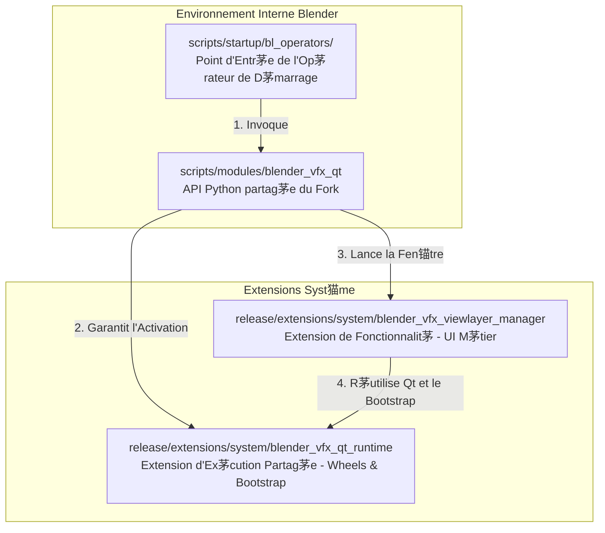

# Guide d'Int茅gration & d'Utilisation de bQt

Industrial CG Platform int猫gre un environnement d'ex茅cution complet PyQt/PySide6 de qualit茅 production (**bQt**) directement en tant qu'extension syst猫me. Cela permet aux d茅veloppeurs de cr茅er des outils d'interface utilisateur riches bas茅s sur Qt au sein de Blender, sans obliger les artistes 脿 installer manuellement des packages Python.

Ce guide d茅taille l'architecture d'int茅gration, les r猫gles de disposition des packages (layout), les configurations d'environnement de s茅curit茅 autonome et les mod猫les avanc茅s d'ing茅nierie logicielle impl茅ment茅s dans l'extension int茅gr茅e **ViewLayer Manager**.

---

## 1. L'Architecture d'Int茅gration en Trois Couches

Pour garantir la maintenabilit茅, la r茅utilisabilit茅 et la s茅curit茅 du code, les int茅grations BQt sur ce fork de Blender sont d茅coupl茅es en trois couches distinctes :



### Couche 1 : L'Extension d'Ex茅cution Partag茅e (`blender_vfx_qt_runtime`)
* **Emplacement :** `release/extensions/system/blender_vfx_qt_runtime`
* **Responsabilit茅 :** Transporte les lourds packages pr茅compil茅s (wheels de PySide6 et d茅pendances) et contient le code de bas niveau pour l'initialisation (Bootstrap). Elle expose un point d'entr茅e minimal et ne contient **aucune** logique m茅tier ou d'interface utilisateur.

### Couche 2 : L'Enveloppe Python Partag茅e du Fork (`blender_vfx_qt`)
* **Emplacement :** `scripts/modules/blender_vfx_qt`
* **Responsabilit茅 :** Un module utilitaire permanent 脿 l'茅chelle du fork. Il r茅sout l'extension d'ex茅cution, garantit l'int茅gration de la boucle d'茅v茅nements Qt avec celle de Blender, et expose des API de gestion de fen锚tres stables :
  - `ensure_runtime()` : Initialise Qt et le lie 脿 la fen锚tre Blender.
  - `show_unique_window(cache, factory)` : G猫re le cycle de vie des fen锚tres de type Singleton.

### Couche 3 : L'Extension de Fonctionnalit茅 (ex. `blender_vfx_viewlayer_manager`)
* **Emplacement :** `release/extensions/system/blender_vfx_viewlayer_manager`
* **Responsabilit茅 :** Se concentre strictement sur la logique m茅tier (cr茅ation des cadres d'interface utilisateur, synchronisation des propri茅t茅s RNA, gestion des pr茅r茅glages et traductions). Elle ne contient aucun fichier wheel pr茅compil茅 et appelle dynamiquement la Couche 2 pour afficher son interface.

---

## 2. Activation Bas茅e sur la Session (Session-Based Enablement)

Afin d'茅viter de ralentir le d茅marrage de Blender ou d'encombrer les pr茅f茅rences de l'utilisateur, BQt utilise un mod猫le d'**Activation Bas茅e sur la Session** :

1. L'extension d'ex茅cution n'est **pas** activ茅e en permanence dans les pr茅f茅rences de l'utilisateur.
2. Un op茅rateur Blender l茅ger (op茅rateur de pont) est enregistr茅 dans les scripts de d茅marrage : `scripts/startup/bl_operators/blender_vfx_viewlayer_manager.py`.
3. Lorsque l'artiste clique sur le point d'entr茅e (par exemple, un bouton de menu ou via la recherche), l'op茅rateur appelle dynamiquement `blender_vfx_qt.ensure_runtime()`, activant les extensions syst猫me et affichant la fen锚tre *uniquement pour la session Blender en cours*.

### Plan de l'Op茅rateur de Pont :
```python
import bpy

class VFX_OT_show_viewlayer_manager(bpy.types.Operator):
    """Lance le gestionnaire ViewLayer autonome bas茅 sur Qt"""
    bl_idname = "wm.blender_vfx_viewlayer_manager_show"
    bl_label = "ViewLayer Manager"
    
    def execute(self, context):
        # 1. R茅soudre le module partag茅
        from blender_vfx_qt import ensure_runtime
        try:
            # 2. Activer dynamiquement les extensions d'ex茅cution et obtenir le point d'entr茅e bQt
            bqt = ensure_runtime()
            
            # 3. Appeler le gestionnaire de l'extension de fonctionnalit茅 pour afficher l'interface utilisateur
            from bl_ext.system.blender_vfx_viewlayer_manager.manager import show_manager
            show_manager()
            return {'FINISHED'}
        except Exception as e:
            self.report({'ERROR'}, f"脡chec du lancement du gestionnaire ViewLayer : {str(e)}")
            return {'CANCELLED'}
```

---

## 3. Cr茅ation d'une Fen锚tre G茅r茅e (Mod猫le Singleton)

Pour 茅viter la duplication des fen锚tres d'outils (qui entra卯ne des conflits d'茅criture de donn茅es de sc猫ne et des fuites de m茅moire), chaque fen锚tre doit se voir attribuer un `objectName` unique et s'enregistrer avec `bqt.add(..., unique=True)`.

### Mod猫le de Lancement Singleton :
```python
# release/extensions/system/blender_vfx_viewlayer_manager/manager.py
from blender_vfx_qt import ensure_runtime, qt_window_is_alive, show_unique_window

# Dictionnaire de cache pour stocker la r茅f茅rence de la fen锚tre active
_window_cache = {"value": None}

def show_manager():
    bqt = ensure_runtime()
    
    # Si la fen锚tre est d茅j脿 active, rafra卯chir ses donn茅es et la ramener au premier plan
    cached_window = _window_cache.get("value")
    if qt_window_is_alive(cached_window):
        cached_window.refresh_from_blender()

    from .window import ViewLayerManagerWindow

    def factory():
        window = ViewLayerManagerWindow()
        # S'enregistrer avec unique=True pour activer la v茅rification de s茅curit茅 Singleton
        bqt.add(window, unique=True)
        return window

    return show_unique_window(_window_cache, factory)
```

---

## 4. Mode de S茅curit茅 Autonome (Standalone Safety Mode)

Par d茅faut, la plateforme s'ex茅cute en **Mode de S茅curit茅 Autonome** sur ce fork. Ce mode offre une stabilit茅 maximale, assure l'int茅grit茅 de la focalisation (focus) du clavier et pr茅vient les plantages al茅atoires associ茅s 脿 l'int茅gration de fen锚tres Win32 brutes dans des conteneurs de widgets Qt.

### Variables d'Environnement par D茅faut
Avant de lancer l'environnement d'ex茅cution, le wrapper `blender_vfx_qt` configure les variables d'environnement suivantes :

* **`BQT_DISABLE_WRAP="1"`** : D茅sactive l'int茅gration de la vue Blender dans un conteneur Qt. La fen锚tre Qt s'ex茅cute comme une fen锚tre autonome native du syst猫me d'exploitation.
* **`BQT_AUTO_ADD="0"`** : Emp锚che bQt de capturer et de g茅rer automatiquement les bo卯tes de dialogue Qt orphelines de premier niveau, garantissant que la filiation est d茅finie explicitement par le d茅veloppeur.
* **`BQT_DOCKABLE_WRAP="0"`** : D茅sactive l'ancrage automatique des widgets enregistr茅s 脿 l'int茅rieur de panneaux `QDockWidget`.
* **`BQT_MANAGE_FOREGROUND="1"`** : Surveille les handles de fen锚tres actives du syst猫me d'exploitation. Si vous quittez Blender, toutes les fen锚tres Qt enregistr茅es sont automatiquement masqu茅es ; si vous revenez sur Blender, leur visibilit茅 est restaur茅e.

> [!NOTE]
> En Mode de S茅curit茅 Autonome, la console affiche l'avertissement suivant : `failed to get blender hwnd, creating new window`. **Cet avertissement est attendu et tout 脿 fait inoffensif.** Il indique simplement que le routage autonome a r茅ussi et ne doit pas 锚tre interpr茅t茅 comme la cause d'un crash.

---

## 5. Configurations d'Environnement de R茅f茅rence

| Variable d'Environnement | Valeur par D茅faut | Valeurs Autoris茅es | Description |
| :--- | :--- | :--- | :--- |
| **`BQT_DISABLE_WRAP`** | `0` (Non d茅finie) | `1`, `0` | D茅finir sur `1` pour activer le Mode de S茅curit茅 Autonome, contournant l'int茅gration du viewport. |
| **`BQT_AUTO_ADD`** | `1` (Non d茅finie) | `1`, `0` | Forc茅e 脿 `0` par le wrapper partag茅 pour 茅viter d'accaparer d'autres fen锚tres flottantes natives. |
| **`BQT_DOCKABLE_WRAP`** | `1` (Non d茅finie) | `1`, `0` | D茅finir sur `0` pour conserver les widgets sous forme de fen锚tres flottantes simples. |
| **`BQT_MANAGE_FOREGROUND`** | `1` | `1`, `0` | Active lorsque `BQT_DISABLE_WRAP="1"`. Alerte Qt pour masquer/restaurer les fen锚tres selon le focus. |
| **`BQT_NO_STYLESHEET`** | `0` (Non d茅finie) | `1`, `0` | D茅finir sur `1` pour contourner la feuille de style sombre personnalis茅e de Blender. |
| **`BQT_DISABLE_CLOSE_DIALOGUE`**| `0` (Non d茅finie) | `1`, `0` | D茅finir sur `1` pour d茅sactiver la confirmation de fermeture Qt, d茅l茅guant la gestion 脿 Blender. |
| **`BQT_LOG_LEVEL`** | `"WARNING"` | `"DEBUG"`, `"INFO"`, `"WARNING"`, `"ERROR"` | Configure la verbosit茅 du journaliseur. |

---

## 6. R猫gles de Disposition des Packages et Extensions

> [!CAUTION]
> **R脠GLE CRITIQUE DE CONDITIONNEMENT :** N'enveloppez jamais votre extension syst猫me dans un sous-r茅pertoire `system` en doublon. Cela emp锚che la d茅tection par Blender et d茅clenche des erreurs d'importation de type `bl_ext.system.*`.

### Structure de R茅pertoire Correcte
```
馃搨 release/extensions/system/
    鈹溾攢鈹€ 馃搨 blender_vfx_qt_runtime/         # Correctement plac茅 directement sous system/
    鈹?    鈹溾攢鈹€ 馃搫 blender_manifest.toml
    鈹?    鈹斺攢鈹€ 馃搫 __init__.py
    鈹斺攢鈹€ 馃搨 blender_vfx_viewlayer_manager/  # Correctement plac茅 directement sous system/
          鈹溾攢鈹€ 馃搫 blender_manifest.toml
          鈹斺攢鈹€ 馃搫 __init__.py
```

### Disposition avec Double Imbrication Incorrecte (脌 PROSCRIRE)
```
馃搨 release/extensions/system/
    鈹斺攢鈹€ 馃搨 system/                          # COUCHE D'IMBRICATION INCORRECTE
          鈹斺攢鈹€ 馃搨 blender_vfx_viewlayer_manager/
```

* **Explication :** Le gestionnaire d'extensions natif de Blender ajoute automatiquement l'espace de noms `system` lors de l'enregistrement des d茅p么ts syst猫me locaux. Si vous cr茅ez manuellement une double structure `system/system/` sur le disque, le d茅p么t s'enregistre mais appara卯t vide lors de l'analyse, provoquant l'茅chec des importations `bl_ext.system.blender_vfx_viewlayer_manager`.

---

## 7. Mod猫les de Conception Avanc茅s du Gestionnaire ViewLayer

Le **ViewLayer Manager** impl茅mente cinq mod猫les de conception avanc茅s pour l'int茅gration de Qt de qualit茅 production dans Blender :

### Mod猫le 1 : Pr茅servation de la Fen锚tre de Contexte (`@context_window`)
Lorsqu'un signal Qt (comme le clic sur un bouton) ex茅cute une fonction (slot), celle-ci s'ex茅cute dans la boucle d'茅v茅nements de Qt. Si elle tente de modifier les donn茅es RNA de Blender ou d'appeler des op茅rateurs (ex. `bpy.ops.ed.undo_push`), Blender plante ou 茅choue en raison d'un contexte de fen锚tre invalide.

Pour r茅soudre ce probl猫me, d茅corez toutes les m茅thodes modifiant l'茅tat de Blender avec le d茅corateur `@context_window` import茅 de `bqt.utils` :

```python
from bqt.utils import context_window
import bpy

class ViewLayerManagerWindow(QtWidgets.QDialog):
    
    @context_window
    def _set_view_layer_use_in_blender(self, view_layer_name: str, value: bool) -> bool:
        # S'ex茅cute avec les param猫tres de contexte s茅curis茅s de la fen锚tre Blender active
        view_layer = self._find_view_layer(view_layer_name)
        if view_layer is None:
            return False
        
        if view_layer.use != value:
            view_layer.use = value
            # Possibilit茅 de pousser des modifications dans la pile d'annulation en toute s茅curit茅
            bpy.ops.ed.undo_push(message="ViewLayer Manager: Update Use")
            return True
        return False
```

### Mod猫le 2 : Synchronisation Bidirectionnelle 脿 Double Chemin
Les artistes peuvent toujours manipuler les couches de rendu (view layers) ou les passes dans les panneaux natifs de Blender pendant que la fen锚tre Qt est ouverte. Pour maintenir une synchronisation parfaite sans conflit de threads, utilisez une double approche de synchronisation :

#### A. Minuteur QTimer pour l'Interrogation du Contexte Actif
Un `QTimer` 脿 basse fr茅quence interroge l'茅tat de la s茅lection active dans Blender :
```python
self._active_state_timer = QtCore.QTimer(self)
self._active_state_timer.setInterval(150) # Intervalle de 150 ms
self._active_state_timer.timeout.connect(self._poll_active_view_layer_state)
self._active_state_timer.start()

def _poll_active_view_layer_state(self) -> None:
    active_name = bpy.context.view_layer.name
    if active_name != self._last_active_view_layer_name:
        self._sync_active_view_layer_from_context()
```

#### B. Blender MsgBus avec Planification S茅curis茅e (Thread-Safe)
Pour une synchronisation imm茅diate sans alourdir le processeur, abonnez-vous au MsgBus de Blender. Afin d'茅viter de redessiner l'interface graphique directement 脿 partir du thread d'ex茅cution du MsgBus, planifiez la mise 脿 jour sur la boucle d'茅v茅nements de Qt 脿 l'aide de `QTimer.singleShot(0, ...)` :

```python
def _register_message_bus(self) -> None:
    # S'abonner aux changements de la couche active (view_layer)
    bpy.msgbus.subscribe_rna(
        key=(bpy.types.Window, "view_layer"),
        owner=self._msgbus_owner,
        args=(self,),
        notify=self._notify_active_view_layer_changed,
    )

def _notify_active_view_layer_changed(window: "ViewLayerManagerWindow") -> None:
    # Envoi thread-safe vers la boucle d'茅v茅nements principale de Qt
    QtCore.QTimer.singleShot(0, window._sync_active_view_layer_from_context)
```

### Mod猫le 3 : Cases 脿 Cocher Interactives par Glissement ("Brush Selection")
Lors de la gestion de listes volumineuses de passes, cocher chaque case individuellement est fastidieux. Le ViewLayer Manager impl茅mente une s茅lection par "balayage" (brush) : cliquer sur une case et faire glisser la souris permet de basculer l'茅tat de toutes les cases survol茅es.

Cela est impl茅ment茅 脿 l'aide d'une sous-classe personnalis茅e et d'un filtre d'茅v茅nements applicatif global :

```python
class BrushCheckBox(QtWidgets.QCheckBox):
    def mousePressEvent(self, event) -> None:
        if event.button() == QtCore.Qt.MouseButton.LeftButton and self.isEnabled():
            # D茅l茅guer 脿 la fen锚tre pour d茅marrer le balayage
            if self._manager._begin_checkbox_brush(self):
                event.accept()
                return
        super().mousePressEvent(event)
```

Dans la classe de fen锚tre principale, installez le filtre d'茅v茅nements pendant le balayage :
```python
def eventFilter(self, watched, event) -> bool:
    if self._checkbox_brush_active:
        if event.type() == QtCore.QEvent.Type.MouseMove:
            # D茅tecter le glissement avec clic gauche enfonc茅
            buttons = event.buttons()
            if not (buttons & QtCore.Qt.MouseButton.LeftButton):
                self._end_checkbox_brush()
                return True
            
            # Trouver le widget sous le curseur et appliquer la modification
            global_pos = QtGui.QCursor.pos()
            checkbox = self._find_brush_checkbox(QtWidgets.QApplication.widgetAt(global_pos))
            if checkbox:
                self._apply_checkbox_brush_to(checkbox)
            return True
            
        elif event.type() == QtCore.QEvent.Type.MouseButtonRelease:
            self._end_checkbox_brush()
            return True
            
    return super().eventFilter(watched, event)
```

### Mod猫le 4 : S茅lection Multiple & Touches Modificatrices dans un QListWidget Personnalis茅
Lorsque vous placez des widgets de cadre personnalis茅s dans un `QListWidget` (via `setItemWidget`), les widgets enfants interceptent les clics de souris. Cela casse le comportement de s茅lection multiple par d茅faut (clics avec Shift/Ctrl).

Le ViewLayer Manager surcharge `mousePressEvent` dans le cadre de l'茅l茅ment personnalis茅 pour intercepter les touches modificatrices actives et d茅clencher manuellement les r猫gles de s茅lection de liste :

```python
class ViewLayerListRowWidget(QtWidgets.QFrame):
    clicked = QtCore.Signal(str, int) # Transmet le nom de la couche et la valeur enti猫re des touches modificatrices

    def mousePressEvent(self, event) -> None:
        if event.button() == QtCore.Qt.MouseButton.LeftButton:
            modifiers = event.modifiers()
            modifier_value = getattr(modifiers, "value", modifiers)
            self.clicked.emit(self._view_layer_name, int(modifier_value))
            event.accept()
            return
        super().mousePressEvent(event)
```

Dans la classe de la fen锚tre principale, 茅coutez le signal personnalis茅 pour recr茅er la s茅lection multiple :
```python
def _on_classic_row_clicked(self, view_layer_name: str, modifiers: int) -> None:
    ctrl_pressed = bool(modifiers & QtCore.Qt.KeyboardModifier.ControlModifier.value)
    shift_pressed = bool(modifiers & QtCore.Qt.KeyboardModifier.ShiftModifier.value)
    
    self.view_layer_list.blockSignals(True)
    if shift_pressed and self._selection_anchor:
        # S茅lectionner tous les 茅l茅ments entre l'ancre et la ligne cible
        self._select_range(self._selection_anchor, view_layer_name)
    elif ctrl_pressed:
        # Inverser l'茅tat de s茅lection de l'茅l茅ment cliqu茅
        self._toggle_selection(view_layer_name)
    else:
        # S茅lection simple par clic classique
        self._select_single(view_layer_name)
        self._selection_anchor = view_layer_name
    self.view_layer_list.blockSignals(False)
    
    self.refresh_from_blender()
```

### Mod猫le 5 : D茅filement Fluide par Pixel pour les Listes
Pour les vues en liste contenant de nombreux 茅l茅ments, le d茅filement par d茅faut ligne par ligne (item-by-item) semble saccad茅. Forcez les incr茅ments de d茅filement bas茅s sur les pixels :

```python
def _configure_smooth_scroll(view: QtWidgets.QAbstractScrollArea) -> None:
    view.setVerticalScrollMode(QtWidgets.QAbstractItemView.ScrollMode.ScrollPerPixel)
    
    vertical_scrollbar = view.verticalScrollBar()
    vertical_scrollbar.setSingleStep(18)  # Taille d'incr茅ment simple en pixels
    vertical_scrollbar.setPageStep(72)    # Taille d'incr茅ment de page en pixels
```

---

## 8. Processus d'Int茅gration d'un Nouvel Outil Qt

Si vous envisagez d'int茅grer un nouvel outil bas茅 sur Qt 脿 ce fork de Blender, veuillez suivre cette proc茅dure structur茅e :

### 脡tape 1 : Cr茅er le Point d'Entr茅e (Op茅rateur de Pont)
D茅clarez d'abord un op茅rateur de pont l茅ger sous `scripts/startup/bl_operators/` (ex. `blender_vfx_my_new_tool.py`). Hookez-le 脿 un bouton de menu ou enregistrez-le dans la recherche globale pour confirmer que l'appel fonctionne avant d'茅crire toute interface graphique complexe.

### 脡tape 2 : Mettre en Place l'Extension de Fonctionnalit茅
Cr茅ez une nouvelle extension syst猫me sous `release/extensions/system/my_new_tool_extension/`. 脡tablissez-y un fichier `blender_manifest.toml` minimal. **Il est strictement interdit** de placer des d茅pendances de type wheel (.whl) dans ce r茅pertoire.

### 脡tape 3 : Impl茅menter l'Interface et la Synchronisation
Impl茅mentez un script `manager.py` l茅ger dans votre extension, qui fait appel au wrapper global `ensure_runtime()` pour charger Qt et instancie votre fen锚tre standalone selon le mod猫le Singleton. Assurez-vous d'utiliser le d茅corateur `@context_window` pour chaque m茅thode modifiant les donn茅es Blender.

---

## 9. Pipeline de Validation et Tests d'Int茅gration

Chaque outil BQt doit subir un pipeline de v茅rification multi-niveaux avant d'锚tre int茅gr茅 脿 la branche principale :

```
[Niveau 1 : Tests de Compilation] 鉃?[Niveau 2 : Validation du Layout] 鉃?[Niveau 3 : Tests de Fum茅e Headless] 鉃?[Niveau 4 : Tests Fonctionnels GUI]
```

1. **Niveau 1 : Tests de Compilation** : Validez la syntaxe des scripts via `python -m compileall`.
2. **Niveau 2 : Validation du Layout** : Ex茅cutez des tests de structure pour vous assurer qu'aucune extension n'est envelopp茅e dans une double couche `system/system/`. Ex茅cutez :
   ```bash
   ctest -R blender_vfx_system_extensions_layout_test
   ```
3. **Niveau 3 : Tests de Fum茅e Headless** : Lancez Blender en mode arri猫re-plan (Headless Mode) et invoquez l'op茅rateur pour vous assurer que le chargement du runtime s'effectue sans exception.
4. **Niveau 4 : Tests Fonctionnels GUI** : Lancez l'environnement Blender complet et ex茅cutez manuellement l'outil pour v茅rifier l'affichage des fen锚tres, la fluidit茅 des barres de d茅filement et le masquage automatique lors du changement d'application active.
