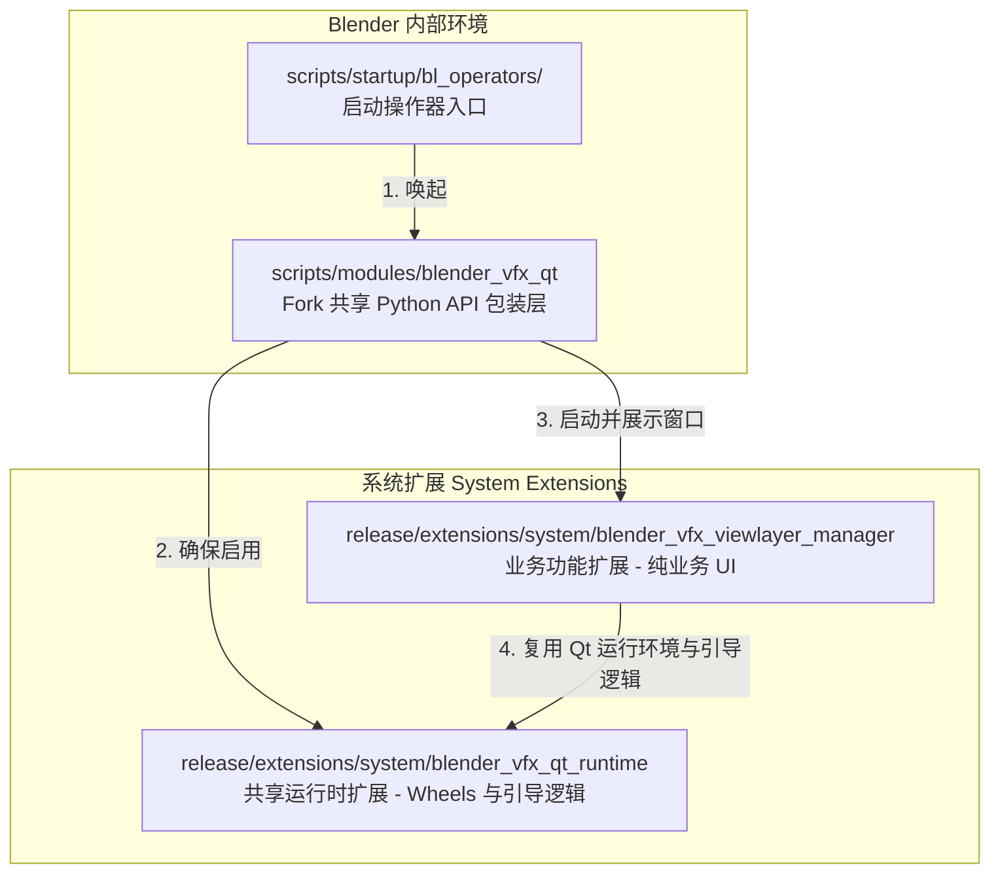

# bQt 集成与使用指南

Industrial CG Platform 将完整的生产级 PyQt/PySide6 运行环境 (**bQt**) 直接作为系统扩展（System Extension）打包内置。这使得开发者能够在 Blender 内部编写丰富的基于 Qt 的高性能 UI 工具，而无需强迫艺术家手动安装 Python 包。

本指南详细说明了在此 Blender 分支（Fork）中集成的底层架构、打包布局规则、独立安全环境配置，以及内置的 **ViewLayer 管理器** 插件中使用的各种高级软件工程设计模式。

---

## 1. 三层集成架构

为了保持代码的可维护性、可复用性与安全性，本 Blender 分支上的 BQt 集成采用了严格的三层解耦架构：



### 第一层：共享运行时扩展 (`blender_vfx_qt_runtime`)
* **存放路径：** `release/extensions/system/blender_vfx_qt_runtime`
* **核心职责：** 仅用于携带笨重的预编译依赖包（PySide6 及其依赖项 wheels），并实现底层的引导启动（Bootstrap）逻辑。它暴露了极薄的运行时初始化钩子，**不包含任何**具体的业务或 UI 代码。

### 第二层：Fork 共享 Python 包装层 (`blender_vfx_qt`)
* **存放路径：** `scripts/modules/blender_vfx_qt`
* **核心职责：** 它是 Fork 全局的常驻公共模块，负责动态查找并启用运行时扩展、控制 Qt 与 Blender 的事件循环集成，并暴露稳定的窗口管理 API：
  - `ensure_runtime()`: 初始化 Qt 并将其安全绑定到 Blender 窗口。
  - `show_unique_window(cache, factory)`: 管理窗口单例生命周期。

### 第三层：业务功能扩展 (例如 `blender_vfx_viewlayer_manager`)
* **存放路径：** `release/extensions/system/blender_vfx_viewlayer_manager`
* **核心职责：** 纯粹关注自身业务逻辑（UI 框架构建、RNA 属性同步、预设管理以及多语言翻译）。它不包含任何编译后的 wheel 文件，仅通过调用第二层 API 动态拉起 UI 窗口。

---

## 2. 基于会话的动态启用机制 (Session-Based Enablement)

为了避免减慢 Blender 的开机启动速度，或在用户配置中写入过多持久设置，BQt 采用了**基于会话的动态启用**设计模式：

1. 运行时扩展在用户偏好设置（Preferences）中**默认不启用**。
2. 在启动脚本中注册一个极轻量的桥接操作器（Bridge Operator）：`scripts/startup/bl_operators/blender_vfx_viewlayer_manager.py`。
3. 当艺术家点击菜单栏按钮或通过空格键搜索启动工具时，该操作器会动态调用 `blender_vfx_qt.ensure_runtime()`，仅在**本次 Blender 会话生命周期内**动态启用系统扩展并拉起窗口，从而实现零开机开销。

### 桥接操作器模板代码：
```python
import bpy

class VFX_OT_show_viewlayer_manager(bpy.types.Operator):
    """启动独立的 Qt ViewLayer 管理器"""
    bl_idname = "wm.blender_vfx_viewlayer_manager_show"
    bl_label = "ViewLayer Manager"
    
    def execute(self, context):
        # 1. 导入 Fork 共享包装模块
        from blender_vfx_qt import ensure_runtime
        try:
            # 2. 动态启用运行时扩展并获取 bQt 环境
            bqt = ensure_runtime()
            
            # 3. 调用具体业务扩展的 manager 接口渲染窗口
            from bl_ext.system.blender_vfx_viewlayer_manager.manager import show_manager
            show_manager()
            return {'FINISHED'}
        except Exception as e:
            self.report({'ERROR'}, f"无法启动 ViewLayer 管理器: {str(e)}")
            return {'CANCELLED'}
```

---

## 3. 创建托管窗口 (单例模式)

为了防止用户重复点击打开多个相同的工具窗口（这在 VFX 制作环境中极易导致底层场景数据读写冲突与内存泄漏），工具窗口必须分配唯一的 `objectName`，并在注册时使用 `bqt.add(..., unique=True)`。

### 单例启动调用模板：
```python
# release/extensions/system/blender_vfx_viewlayer_manager/manager.py
from blender_vfx_qt import ensure_runtime, qt_window_is_alive, show_unique_window

# 用于存储活动窗口引用的字典缓存
_window_cache = {"value": None}

def show_manager():
    bqt = ensure_runtime()
    
    # 若窗口已处于活动状态，则刷新其数据并将其置于最前
    cached_window = _window_cache.get("value")
    if qt_window_is_alive(cached_window):
        cached_window.refresh_from_blender()

    from .window import ViewLayerManagerWindow

    def factory():
        window = ViewLayerManagerWindow()
        # 注册并传入 unique=True，启用单例安全校验
        bqt.add(window, unique=True)
        return window

    return show_unique_window(_window_cache, factory)
```

---

## 4. 安全独立窗口模式 (Standalone Safety Mode)

本分支中默认以**安全独立窗口模式**启动 Qt 运行环境。该模式在 UI 响应度、键盘焦点捕获（Focus Integrity）上最为稳健，完全规避了将原生 Win32 视口句柄强制嵌入 Qt 窗口容器中时可能引发的随机崩溃。

### 核心环境变量设置
在拉起 Qt 环境前，`blender_vfx_qt` 模块会默认配置以下环境变量：

* **`BQT_DISABLE_WRAP="1"`**：禁用将 Blender 视口嵌入到 Qt 布局框架中的行为。Qt 窗口将以完全独立的操作系统级原生窗口形式运行。
* **`BQT_AUTO_ADD="0"`**：禁用 bQt 自动捕获并托管孤立的顶级 Qt 弹窗的行为，确保窗口父子级关系完全由开发者定义。
* **`BQT_DOCKABLE_WRAP="0"`**：禁用将已注册的 Widget 自动包装在 `QDockWidget` 侧边面板中的默认行为。
* **`BQT_MANAGE_FOREGROUND="1"`**：监控操作系统级别的活动窗口句柄。切出 Blender 时自动隐藏所有已注册的 Qt 浮动窗口；切回 Blender 时，瞬间恢复它们的显示。

> [!NOTE]
> 在安全独立窗口模式下，Blender 控制台会输出一条警告：`failed to get blender hwnd, creating new window`。**该警告完全正常且无害**。它表明独立路由已成功接管，切勿将其误判为崩溃根因。

---

## 5. 环境配置变量速查表

| 环境变量 | 默认值 | 允许的值 | 详细说明 |
| :--- | :--- | :--- | :--- |
| **`BQT_DISABLE_WRAP`** | `0` (未设置) | `1`, `0` | 设为 `1` 启用安全独立窗口模式，跳过复杂的视口容器嵌入。 |
| **`BQT_AUTO_ADD`** | `1` (未设置) | `1`, `0` | 在共享包装器中被强制设为 `0`，防止误捕获其他原生悬浮窗。 |
| **`BQT_DOCKABLE_WRAP`** | `1` (未设置) | `1`, `0` | 设为 `0` 保持 Widget 为干净的浮动小工具，而不是嵌入式面板。 |
| **`BQT_MANAGE_FOREGROUND`** | `1` | `1`, `0` | 在 `BQT_DISABLE_WRAP="1"` 时生效。启用前后台可见性自动同步。 |
| **`BQT_NO_STYLESHEET`** | `0` (未设置) | `1`, `0` | 设为 `1` 禁用内置的深色 Blender 风格样式表。 |
| **`BQT_DISABLE_CLOSE_DIALOGUE`**| `0` (未设置) | `1`, `0` | 设为 `1` 关闭 Qt 侧自定义的退出确认弹窗，由 Blender 统一处理保存。 |
| **`BQT_LOG_LEVEL`** | `"WARNING"` | `"DEBUG"`, `"INFO"`, `"WARNING"`, `"ERROR"` | 配置运行时的日志输出级别。 |

---

## 6. 系统扩展打包与目录结构规范

> [!CAUTION]
> **绝对不可违背的打包规则：** 绝对不要将系统扩展包装在重复的多余 `system` 文件夹中。此类目录多重嵌套会导致扫描失效并触发 `bl_ext.system.*` 导入错误。

### 正确的目录结构布局
```
📂 release/extensions/system/
    ├── 📂 blender_vfx_qt_runtime/         # 正确直接放在 system/ 下
    │     ├── 📄 blender_manifest.toml
    │     └── 📄 __init__.py
    └── 📂 blender_vfx_viewlayer_manager/  # 正确直接放在 system/ 下
          ├── 📄 blender_manifest.toml
          └── 📄 __init__.py
```

### 错误的嵌套结构布局（切勿使用）
```
📂 release/extensions/system/
    └── 📂 system/                          # 错误的多余嵌套层
          └── 📂 blender_vfx_viewlayer_manager/
```

* **产生原因：** Blender 自带的扩展管理器（Extension Manager）在注册系统本地仓库时，会自动在解析路径中拼接一级 `system` 命名空间。若你在磁盘源码树上再次手动嵌套一层 `system/system/`，解析层便会出现通路阻断，导致文件明明存在但外部根本无法 `import` 导入业务模块。

---

## 7. ViewLayer 管理器高级设计模式

**ViewLayer 管理器** 实现了五种生产级的高级 Qt-Blender 交互设计模式：

### 模式 1：上下文窗口保护 (`@context_window`)
当用户在 Qt 界面中触发操作（例如点击按钮）时，业务槽函数是在 Qt 的事件循环线程中运行的。如果此时直接读写 Blender 的 RNA 属性或调用算子（例如 `bpy.ops.ed.undo_push`），Blender 常常会因上下文（Context）未初始化或缺失而发生崩溃。

要解决此问题，请使用 `bqt.utils` 提供的 `@context_window` 装饰器对所有修改 Blender 场景数据的 Qt 类方法进行装饰：

```python
from bqt.utils import context_window
import bpy

class ViewLayerManagerWindow(QtWidgets.QDialog):
    
    @context_window
    def _set_view_layer_use_in_blender(self, view_layer_name: str, value: bool) -> bool:
        # 该方法在执行时，会自动包裹在安全且活动的 Blender 窗口上下文参数中
        view_layer = self._find_view_layer(view_layer_name)
        if view_layer is None:
            return False
        
        if view_layer.use != value:
            view_layer.use = value
            # 此时可以安全推送撤销状态
            bpy.ops.ed.undo_push(message="ViewLayer Manager: Update Use")
            return True
        return False
```

### 模式 2：双路径双向状态同步
当 Qt 窗口打开时，艺术家仍能在 Blender 原生的属性属性面板中更改属性。为了确保 Qt UI 的实时同步且不发生线程冲突，需结合两种同步方式：

#### A. QTimer 轮询活动上下文更改
使用一个轻量级的 `QTimer` 低频（如 150 毫秒间隔）检查 Blender 中的当前活动项，发生更改时刷新 UI：
```python
self._active_state_timer = QtCore.QTimer(self)
self._active_state_timer.setInterval(150) # 150ms 间隔
self._active_state_timer.timeout.connect(self._poll_active_view_layer_state)
self._active_state_timer.start()

def _poll_active_view_layer_state(self) -> None:
    active_name = bpy.context.view_layer.name
    if active_name != self._last_active_view_layer_name:
        self._sync_active_view_layer_from_context()
```

#### B. Blender 消息总线 (MsgBus) 的线程安全调度
对于特定属性的变更订阅，使用 Blender 的 MsgBus。由于 MsgBus 回调是在 Blender 内部线程中激发的，不能直接操控 Qt UI。需使用 `QTimer.singleShot(0, ...)` 将重绘逻辑安全传递给 Qt 事件循环的 UI 线程：

```python
def _register_message_bus(self) -> None:
    # 订阅活动 view_layer 的修改事件
    bpy.msgbus.subscribe_rna(
        key=(bpy.types.Window, "view_layer"),
        owner=self._msgbus_owner,
        args=(self,),
        notify=self._notify_active_view_layer_changed,
    )

def _notify_active_view_layer_changed(window: "ViewLayerManagerWindow") -> None:
    # 线程安全分发回 Qt 的主事件循环线程执行重绘
    QtCore.QTimer.singleShot(0, window._sync_active_view_layer_from_context)
```

### 模式 3：滑动连选复选框 ("Brush Selection")
在拥有大量渲染通道（Render Passes）的表格中，逐个点击复选框非常繁琐。ViewLayer 管理器实现了一种“刷子”选择体验：按住鼠标左键并在复选框列表上划过，即可一气呵成批量反转或设置它们的状态。

这是通过自定义 `BrushCheckBox` 并安装全局应用程序事件过滤器实现的：

```python
class BrushCheckBox(QtWidgets.QCheckBox):
    def mousePressEvent(self, event) -> None:
        if event.button() == QtCore.Qt.MouseButton.LeftButton and self.isEnabled():
            # 委托给主窗口开始“刷动”操作
            if self._manager._begin_checkbox_brush(self):
                event.accept()
                return
        super().mousePressEvent(event)
```

在主窗口类中，滑动期间捕获鼠标划过的目标控件：
```python
def eventFilter(self, watched, event) -> bool:
    if self._checkbox_brush_active:
        if event.type() == QtCore.QEvent.Type.MouseMove:
            # 监测鼠标拖拽状态
            buttons = event.buttons()
            if not (buttons & QtCore.Qt.MouseButton.LeftButton):
                self._end_checkbox_brush()
                return True
            
            # 获取光标下的 Widget 并应用批量修改
            global_pos = QtGui.QCursor.pos()
            checkbox = self._find_brush_checkbox(QtWidgets.QApplication.widgetAt(global_pos))
            if checkbox:
                self._apply_checkbox_brush_to(checkbox)
            return True
            
        elif event.type() == QtCore.QEvent.Type.MouseButtonRelease:
            self._end_checkbox_brush()
            return True
            
    return super().eventFilter(watched, event)
```

### 模式 4：自定义 QListWidget Item 中的多选与修饰键处理
当我们把自定义的复杂 Widget（如带图表的自定义帧）通过 `setItemWidget` 塞进 `QListWidget` 中时，子 Widget 会拦截所有的鼠标事件。这会导致原本 `QListWidget` 自带的多选（按住 Shift 或 Ctrl 键连选）失效。

ViewLayer 管理器通过重写子 Widget 的 `mousePressEvent`，提取激活的键盘修饰键，然后手工回调主窗口的列表选择算法：

```python
class ViewLayerListRowWidget(QtWidgets.QFrame):
    clicked = QtCore.Signal(str, int) # 发送视图层名称与修饰键的整型数值

    def mousePressEvent(self, event) -> None:
        if event.button() == QtCore.Qt.MouseButton.LeftButton:
            modifiers = event.modifiers()
            modifier_value = getattr(modifiers, "value", modifiers)
            self.clicked.emit(self._view_layer_name, int(modifier_value))
            event.accept()
            return
        super().mousePressEvent(event)
```

在主窗口中，接收信号并实现多选覆盖：
```python
def _on_classic_row_clicked(self, view_layer_name: str, modifiers: int) -> None:
    ctrl_pressed = bool(modifiers & QtCore.Qt.KeyboardModifier.ControlModifier.value)
    shift_pressed = bool(modifiers & QtCore.Qt.KeyboardModifier.ShiftModifier.value)
    
    self.view_layer_list.blockSignals(True)
    if shift_pressed and self._selection_anchor:
        # 选择锚点与目标行之间的所有项
        self._select_range(self._selection_anchor, view_layer_name)
    elif ctrl_pressed:
        # 仅反转当前选中项的状态
        self._toggle_selection(view_layer_name)
    else:
        # 普通单选
        self._select_single(view_layer_name)
        self._selection_anchor = view_layer_name
    self.view_layer_list.blockSignals(False)
    
    self.refresh_from_blender()
```

### 模式 5：极致像素级流畅列表滚动
对于列表元素过长且紧凑的视图，原生 Qt 滚动条是按项（item-by-item）滚动的，会有明显的顿挫感。可以通过强制开启像素级平滑滚动来优化艺术家体验：

```python
def _configure_smooth_scroll(view: QtWidgets.QAbstractScrollArea) -> None:
    view.setVerticalScrollMode(QtWidgets.QAbstractItemView.ScrollMode.ScrollPerPixel)
    
    vertical_scrollbar = view.verticalScrollBar()
    vertical_scrollbar.setSingleStep(18)  # 单步平滑像素距离
    vertical_scrollbar.setPageStep(72)    # 页面单页翻滚像素距离
```

---

## 8. 新建 Qt 工具开发流程

若你计划在此 Blender 分支中集成全新的 Qt 工具，请务必遵循以下安全的接入规范：

### 第一步：构建桥接算子入口
首先在 `scripts/startup/bl_operators/` 目录下创建轻量的入口算子（例如 `blender_vfx_my_new_tool.py`）。确认能正常注册并在菜单栏显示，先不要编写任何复杂的 UI 逻辑。

### 第二步：创建不含依赖的系统扩展
在 `release/extensions/system/my_new_tool_extension/` 目录下建立你自己的扩展包。配置好基础的 `blender_manifest.toml`。**绝对禁止**在该扩展包内携带任何 `.whl` 文件。

### 第二步：编写 UI 与同步机制
在扩展包内实现 `manager.py`，在其内调用常驻包装模块的 `ensure_runtime()` 引导 Qt，并基于单例模式实例化你的 Standalone 窗口。确保涉及 Blender 属性修改的方法被 `@context_window` 正确覆盖。

---

## 9. 自动化集成与验证流水线

所有开发的 BQt 工具在合并进入主线前，必须通过以下完整的分层验证验证链：

```
[步骤一：编译验证] ➔ [步骤二：布局完整性验证] ➔ [步骤三：后台模式冒烟验证] ➔ [步骤四：GUI 功能冒烟验证]
```

1. **步骤一：编译验证**：使用 `python -m compileall` 检查所有脚本的语法正确性。
2. **步骤二：布局完整性验证**：运行打包布局测试，防止扩展被误封装在嵌套的 `system/system/` 文件夹下。执行测试命令：
   ```bash
   ctest -R blender_vfx_system_extensions_layout_test
   ```
3. **步骤三：后台模式冒烟验证**：启动 Blender 后台模式（Headless Mode），调用算子测试确保启用 `bqt` 时不发生导入死锁或崩溃。
4. **步骤四：GUI 功能冒烟验证**：在编译后的 Blender release 中物理拉起工具窗口，实测滑动连选、像素级平滑滚动以及前后台焦点切换自动隐藏功能。
